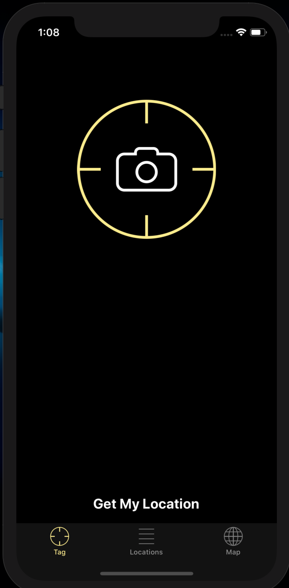
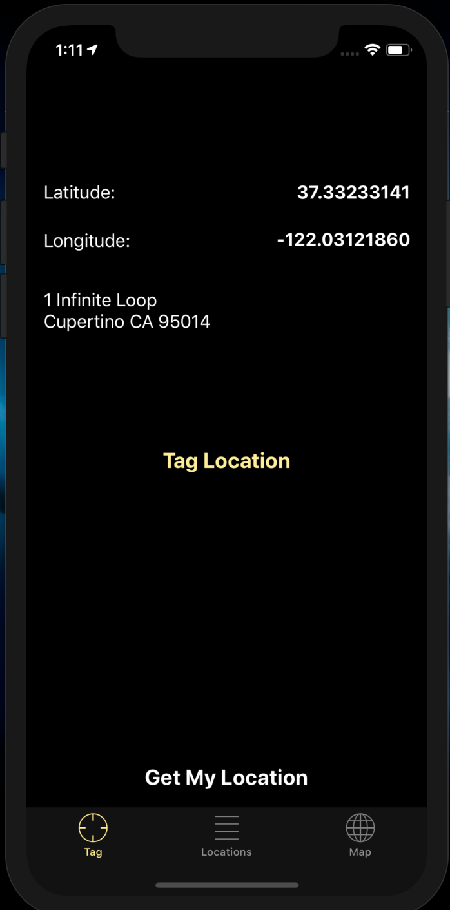
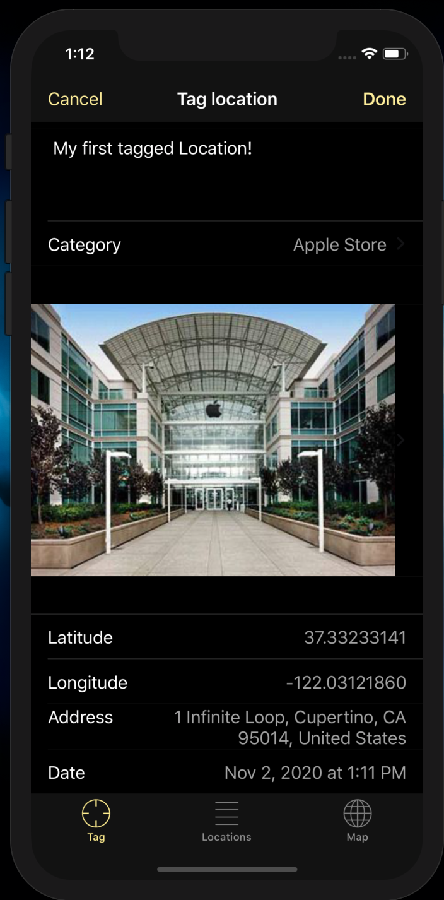
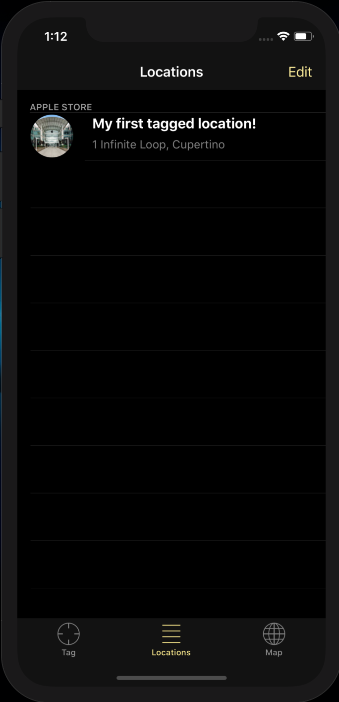
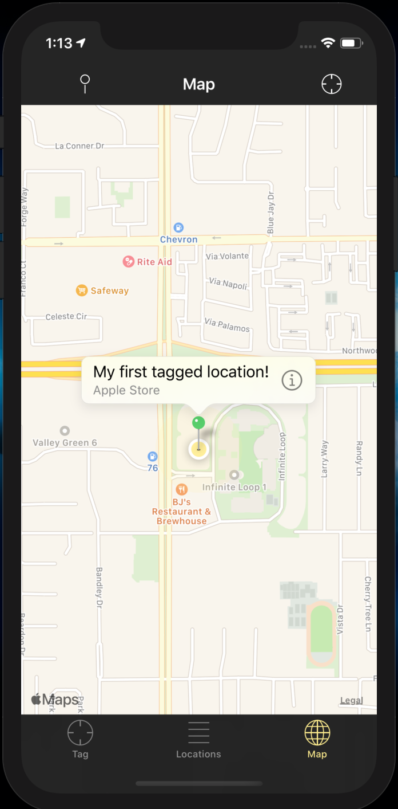

# LocationDiaryApp
An app that uses GPS to track your current location and then allowing you to take a picture (or upload one) and add a little description to it and then saving it using CoreData.

Features:
- Locate yourself via GPS 
- Save that location and add a picture and description to it
- Organize your locations via categories
- Show all your locations on a map

